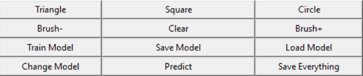

# Shape Classifier AI

Shape Classifer AI 🤖 is a program that can detect any shape 💠 .

## Description 

1. After running the program a GUI will be there n the screen .

2. Enter the name of the project .

3. Add the shapes (MAX 3)

    
    
    

4.Draw the shapes according to the name of the shape .

5.After drawing th shape train the model .

6. Now draw a shape and click predict .

## Features

1. Change the brush shape (+/-) .
2. Can predict any shape as the user train the model .
3. Can train the model as many time as the user want . The more sample model gets the accuracy gets up.
4. Can change the model (SVM, Logistic Regression , Random forest , Decision tree , KNN etc )
5. Save the model if the user is happy with accuracy .

## Video Demo 

## Acknowledgements

 - [krish Naik](https://github.com/krishnaik06)

## Demo Video
[Demo Vdeo](Assets/Demo.mp4)

## Upgradation is coming soon also a web version 😊
